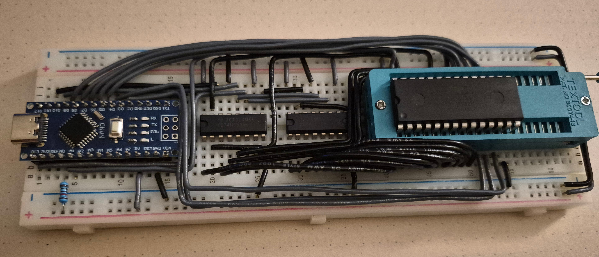

# 6502

Code for 65c02 breadboard computer project.

## EEPROM flasher



A programmer for the AT28C256, split between PlatformIO firmware for an Arduino
Nano (`eeprom-flasher-arduino/`) and a Go CLI that drives it over serial with
a simple custom comunication protocol (`eeprom-flasher-host/`). 
Two daisy-chained 74HC595s supply the address lines
over hardware SPI, with the last bit of the chain wired to `/OE`. It dumps the
whole 32K in a couple of seconds, and flashes an image using 64-byte page writes
before reading it back to verify.

### Usage

Build and upload:

```sh
cd eeprom-flasher-arduino && pio run -t upload
cd ../eeprom-flasher-host && go build
```

Dump the chip to a file:

```sh
./eeprom-flasher-host dump -o rom.bin
```

Write an image and verify it:

```sh
./eeprom-flasher-host flash rom.bin
```

Both accept `-p` to pick the serial port (default `/dev/ttyUSB0`).
